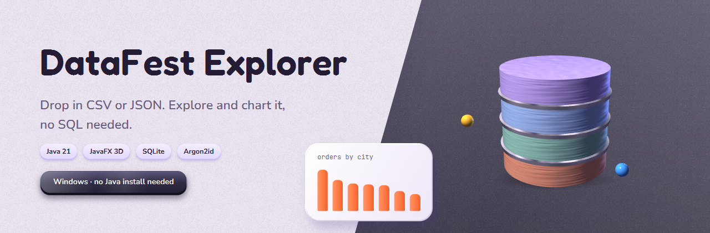
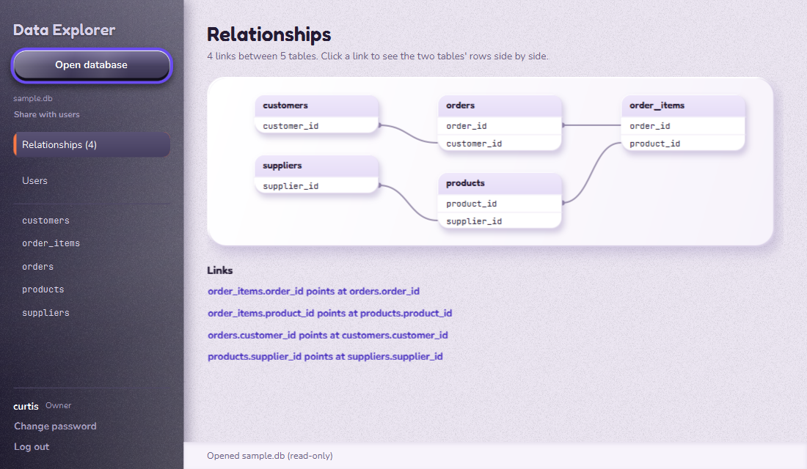
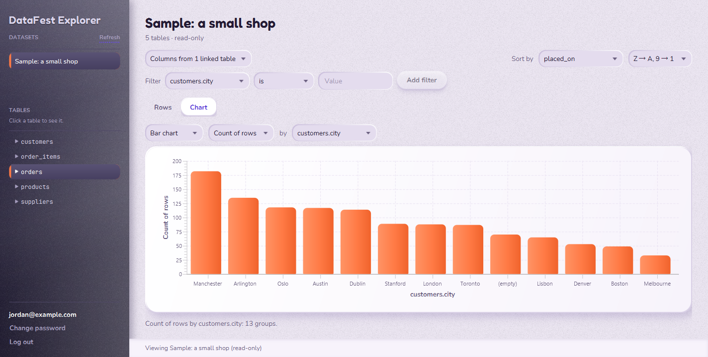

<h1 align="center">
  
</h1>

  <a href="https://github.com/curtispfoster/DataExplorer-releases/releases/latest"><b>Download for Windows</b></a>

A desktop data explorer for data events like ASA DataFest. Admins drop in CSV or JSON files to
turn them into datasets, and everyone else explores and charts them by pointing and clicking,
with no SQL needed.

This repo holds the downloads only. The source code is private and available on request.

  

## What it does

1. **Sign in.** The first person to launch the app creates the owner account. After that,
   everyone logs in with their own account, and new participants can create one from the login
   screen. Passwords are hashed with Argon2id, and there are no default passwords.
2. **Admins bring the data in.** An admin drops CSV, TSV, JSON or JSON Lines files onto the admin
   screen, and the app turns them into tables in a new SQLite database. It works out how the
   files link together (for example, `orders.customer_id` → `customers.id`), saves those links as
   foreign keys and draws them as a diagram. CSV files can be any size: an 8-million-row file
   imports in a few minutes. JSON files are limited to 200 MB.
3. **Users explore it without knowing SQL.** Pick a dataset and a table, pull in columns from
   linked tables, add filters and a sort, and turn the result into a bar, line, pie or scatter
   chart. The app writes the SQL behind the scenes, and datasets open read-only, so nobody can
   break the shared data.

A built-in sample shop database is always there to practise on.

  
  

## Install (Windows)

You don't need Java, an IDE or admin rights: the app bundles its own Java runtime.

1. Download the `.zip` from the [latest release](https://github.com/curtispfoster/DataExplorer-releases/releases/latest).
2. Unzip it anywhere, for example your Documents folder. Keep the `DataExplorer` folder
   together: `DataExplorer.exe` needs the `app` and `runtime` folders next to it.
3. Double-click `DataExplorer.exe`. The app isn't code-signed, so Windows may show
   **"Windows protected your PC"**. Click **More info**, then **Run anyway**.

Each release lists the zip's SHA-256, so you can check your download with
`Get-FileHash DataExplorer-*.zip` in PowerShell.

### First launch

- **The owner (whoever sets the app up):** the first launch opens **Set up**. Choose the owner's
  username and password (at least 8 characters, with a number and a symbol), then sign in. The
  owner imports the datasets and manages accounts.
- **Teammates on the same computer:** on the login screen, click **Create an account**. You'll
  get a user account that can explore and chart every dataset the owner has imported.
- **Forgot your password?** Ask the owner or an admin to reset it from the Users panel. You'll
  choose a new one the next time you sign in.

### Where your data is kept

Everything lives in `%LOCALAPPDATA%\DataExplorer\data`: the accounts (`users.db`), the
imported datasets (`imports\`) and the sample shop. It's inside your Windows profile, so other
Windows logins on the same PC can't reach it.

- **Back up** that folder to keep your accounts and datasets.
- **Deleting** it resets the app: the next launch shows Set up again, and the imported datasets
  are gone.

### Updating and uninstalling

- **Updating:** replace the unzipped folder with the new one. Your accounts and datasets are kept,
  because they live in `%LOCALAPPDATA%`, not in the program folder.
- **Coming from DataFest Explorer or HelloApplication** (the app's old names): the first launch
  moves `%LOCALAPPDATA%\DataFestExplorer\data` (or `HelloApplication\data`) to the new folder, so
  everything carries over. You can then delete the old unzipped folder.
- **Uninstalling:** delete the unzipped folder. To remove your data too, delete
  `%LOCALAPPDATA%\DataExplorer`.

## Problems?

[Report a bug or suggest an idea](https://github.com/curtispfoster/DataExplorer-releases/issues/new/choose).

## License

Free to download and use. The app may not be redistributed, sold or reverse engineered. See
[LICENSE](LICENSE) for the full terms.

Built with Java 21, JavaFX 21, SQLite and BouncyCastle by [Curtis Foster](https://github.com/curtispfoster).
